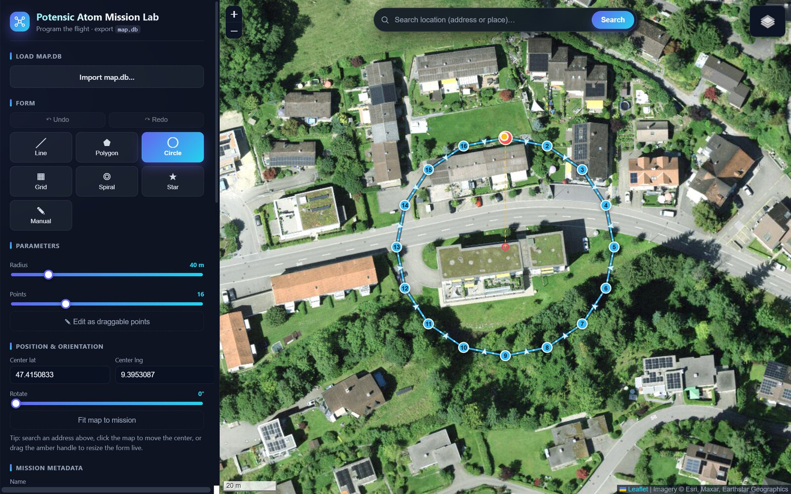

# Atom Mission Lab

[](https://github.com/patbaumgartner/potensic-atom-mission-lab/actions/workflows/ci.yml)
[](https://github.com/patbaumgartner/potensic-atom-mission-lab/actions/workflows/deploy.yml)
[](vite.config.ts)
[](LICENSE)


**[▶ Live demo](https://patbaumgartner.github.io/potensic-atom-mission-lab/)**



A browser-first mission planner for the first-generation **Potensic Atom** and the
**PotensicPro** Android app. Draw or code waypoint patterns, preview them on a
satellite map, and export a PotensicPro-compatible `map.db` you can load on the
drone. It uses the drone's **native waypoint-mission execution** — there is no
live control-frame injection.

> Device-side tooling (debuggable APK, side-by-side clone, log pulls, pushing a
> generated `map.db` to the phone) lives in
> [debug-clone-tools/README.md](debug-clone-tools/README.md).

## Features

- **Flight forms** — line, polygon, circle, survey grid (lawnmower), spiral,
  star, and free-hand manual paths.
- **Location search** — geocode any address/place, fly the map there, and show a
  concise Swiss-style address (`Street Nr, PLZ City`).
- **Direct editing** — drag a resize handle to grow/shrink a form, a rotate
  slider to spin it, drag individual waypoints, drag the center marker, and
  convert any form to editable points. Reverse, mirror, close-loop, and full
  undo/redo.
- **Drop center / My location** — click the crosshair button in the search bar
  and tap the map to place the mission center, or use **My location** to jump
  to your GPS position — both work in all modes including manual draw.
- **Mission library** — keep several missions (each its own color), edit them
  with live sync, and export them all into one `map.db` (each as its own
  PotensicPro route). Everything persists in `localStorage`.
- **Safety & battery** — endurance estimate for ~20 min packs (with reserve),
  max-distance-from-home, and a geofence with in-UI warnings.
- **Analysis** — import an actual flown track (GPX / GeoJSON / CSV) and compare
  planned vs actual (max/average deviation, distances).
- **Inspect, export & project save** — drag-drop an existing `map.db` to view
  its records; export `map.db`, GeoJSON, or a markdown field checklist; save and
  restore the full workspace (library + settings) as a portable JSON project file.

## Getting started

```bash
npm install
npm run dev            # start the planner at http://localhost:5173
```

Other scripts:

```bash
npm run build          # typecheck + production build
npm test               # run the unit tests
npm run test:coverage  # tests with a 100% coverage gate
npm run generate:sample -- circle 30 12   # write fixtures/sample-map.db
```

## How it works

1. Search a location, click the map, or use **Drop center** to set where the
   mission is planned.
2. Pick a form and adjust its parameters, or draw a manual path.
3. Review the stats and safety warnings, then **Export map.db**.
4. Load the `map.db` onto the drone using the
   [device tooling](debug-clone-tools/README.md), or open PotensicPro and select
   the mission.

### Atom 1 constraints (enforced in the UI)

- The **2D form/path is fully programmable**.
- **Per-waypoint height and gimbal are NOT honored** by Atom 1 — you climb to the
  target altitude manually before starting. Height/speed are stored as mission
  metadata and appear in the generated field checklist.
- Practical cap of ~45 waypoints per flight record; larger missions auto-chunk.

## Project structure

```text
src/
  App.tsx                       app shell + all UI state
  main.tsx                      React entry point
  styles.css                    theme + layout
  features/
    mission/
      geometry.ts               geodesic math + flight-form generators
      formBuilder.ts            build waypoints from a form + parameters
      validator.ts              conservative Atom mission constraints
      missionTypes.ts           mission/waypoint types + limits
      MapView.tsx               Leaflet map, overlays, drag/fly interactions
    potensic/
      atomSchema.ts             exact on-device map.db schema
      atomMapDb.ts              map.db generation + parsing (sql.js)
      sqlLoader.ts              browser sql.js loader (wasm)
      sqlLoaderNode.ts          Node sql.js loader (tests)
    geo/formatAddress.ts        Nominatim address → Swiss address
    logs/trackImport.ts         GPX / GeoJSON / CSV track parser
    export.ts                   GeoJSON + file-download helpers
tests/                          unit tests (100% coverage on logic modules)
scripts/generate-sample-mapdb.ts   CLI to emit a sample map.db
fixtures/                       generated sample databases
```

## Tech stack

- **Vite + React + TypeScript**
- **Leaflet** for the map (OpenStreetMap + Esri satellite tiles)
- **sql.js** (SQLite compiled to WebAssembly) for reading/writing `map.db`
- **Nominatim** (OpenStreetMap) for geocoding
- **Vitest** for unit tests

## PotensicPro database schema

The `map.db` is a standard SQLite file. The tables used by Mission Lab are:

| Table              | Used              | Notes                                                                                                 |
| ------------------ | ----------------- | ----------------------------------------------------------------------------------------------------- |
| `flightrecordbean` | ✅ read & write   | One row per flight chunk; `date` = label, `height`/`speed` = metadata strings, `num` = waypoint count |
| `multipointbean`   | ✅ read & write   | Linked waypoints: `(lat, lng)` as REAL, `flightrecordbean_id` FK                                      |
| `android_metadata` | ✅ write only     | Single row: `locale = 'en_US_#u-mu-celsius'`                                                          |
| `table_schema`     | ✅ write only     | Registry seed rows; required for PotensicPro to open the DB                                           |
| `flightnotes`      | ⬜ created, empty | Schema created to satisfy PotensicPro; never written                                                  |
| `flightlog`        | ⬜ created, empty | Same                                                                                                  |
| `uomrecord`        | ⬜ created, empty | Same                                                                                                  |
| `uomuploadbody`    | ⬜ created, empty | Telemetry upload rows; not written                                                                    |

**Known / verified**: `PRAGMA user_version = 5`, `page_size = 4096`, `encoding = UTF-8`.  
**Per-waypoint altitude/gimbal**: columns are NOT present in Atom 1's `multipointbean` — height and speed are mission-level metadata only, stored in `flightrecordbean`.  
**Inferred**: the exact semantics of `flightnotes`, `uomuploadbody`, and `uomrecord` were observed in a captured on-device database but are never written by Mission Lab; the tables exist only to match the schema PotensicPro expects.

Schema constants live in [src/features/potensic/atomSchema.ts](src/features/potensic/atomSchema.ts).

## Testing & coverage

All pure-logic modules are unit-tested to **100%** statements, branches,
functions, and lines, enforced by a coverage gate in
[vite.config.ts](vite.config.ts). The UI-integration files (`App.tsx`,
`MapView.tsx`, `main.tsx`, and the browser `sqlLoader.ts`) require a live
DOM/map and are validated interactively rather than in unit tests, so they are
excluded from the coverage gate.

```bash
npm run test:coverage
```

## Field workflow

A typical flight session from desk to drone:

1. **Plan** — search or tap the map to pick a location; choose a flight form
   (circle, grid, spiral, …) or draw a manual path; adjust altitude and speed.
2. **Review** — check the safety panel: endurance bar, geofence radius,
   max-home distance, and the validation list.
3. **Export map.db** — add the mission to the library, then click
   _Export map.db_ to download the SQLite file.
4. **Transfer** — push `map.db` to the phone running PotensicPro using
   [`debug-clone-tools/push-mapdb-to-clone.sh`](debug-clone-tools/README.md)
   or copy it manually to
   `Android/data/com.ipotensic.potensicpro/files/MapData/`.
5. **Fly** — open PotensicPro, select the mission, climb to the planned
   altitude manually, then start.
6. **Analyse** — export the flown track from PotensicPro and import it back
   into Mission Lab to compare planned vs actual deviation.

### Saving and sharing a project

Use **Export project…** to save the full workspace (library, settings, params)
as a single JSON file. Share it with a colleague or move it between devices with
**Import project…**.

## Troubleshooting

| Symptom                                   | Likely cause                                    | Fix                                                                    |
| ----------------------------------------- | ----------------------------------------------- | ---------------------------------------------------------------------- |
| _"Could not read this file as a map.db"_  | File is not a valid SQLite/PotensicPro database | Re-export from Mission Lab or use the correct file                     |
| _"No flight records found"_               | Blank or freshly created DB                     | Export at least one mission first                                      |
| _"map.db contains invalid coordinates"_   | Corrupt DB from a failed write                  | Re-export a clean file                                                 |
| Location search returns no results        | Query too ambiguous                             | Append the country, e.g. _"Zürich, Switzerland"_                       |
| _"Could not get location"_ on My location | Browser denied permission                       | Allow location access in the browser's site settings                   |
| Map tiles don't load offline              | Tiles require network access                    | Pre-visit the area while online; tile caching is browser-controlled    |
| Mission auto-chunks unexpectedly          | > 45 waypoints per record                       | Reduce _Chunk size_ or split the mission into multiple library entries |
| Battery bar shows 100 %+                  | Mission is too long for the configured battery  | Shorten the path or increase the battery setting                       |

## Deployment

Every push to `main` builds the app and publishes it to **GitHub Pages** via the
[deploy workflow](.github/workflows/deploy.yml). Enable it once under
**Settings → Pages → Build and deployment → Source: GitHub Actions**. The live
build is at
<https://patbaumgartner.github.io/potensic-atom-mission-lab/>.

## Contributing

Issues and pull requests are welcome. Before opening a PR, please make sure the
checks pass locally:

```bash
npm run typecheck
npm run test:coverage   # must stay at 100% on logic modules
npm run build
```

## Disclaimer

This is an independent research/hobby project and is **not affiliated with
Potensic**. It plans missions the drone executes natively; it does not modify
firmware or bypass flight limits, geofencing, or safety systems. You are
responsible for flying legally and safely — mind local drone regulations,
airspace, and line of sight.

## License

[MIT](LICENSE) © Patrick Baumgartner
